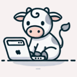

# CowPilotV2

CowPilotV2 is an AI-powered browser automation extension that uses Large Language Models to navigate and interact with web pages autonomously. It combines decision-making and action execution models to perform web tasks with minimal user intervention.

## Table of Contents

- [Installing and Running](#installing-and-running)
- [Video Demo](#video-demo)
- [Resources](#resources)
- [Common Failure Cases](#common-failure-cases)
- [Contributing](#contributing)

## Video Demo

[Screen Recording.mov](Screen%20Recording.mov) - Watch the video demonstration of the system in action.

## Resources

- **Paper**: <!-- TODO: Add link to paper once published -->
- **Dataset**: <!-- TODO: Add link to dataset once available -->
- **Previous CowPilot Repository**: <!-- TODO: Add link to previous CowPilot repo -->

## Installing and Running

Currently this extension is only available through this GitHub repo. We'll release it on the Chrome Web Store after adding features to increase its usability for a non-technical audience. To build and install the extension locally on your machine, follow the instructions below.

### Installing the extension

1. Ensure you have [Node.js](https://nodejs.org/) >= **16**.
2. Clone this repository
3. Run `yarn` to install the dependencies
4. Run `yarn add -D typescript @babel/preset-typescript` to account for additional dependencies
5. Run `yarn add -D @babel/preset-react` to account for additional dependencies
6. Run `yarn start` to build the package
7. Load your extension on Chrome by doing the following:
   1. Navigate to `chrome://extensions/`
   2. Toggle `Developer mode`
   3. Click on `Load unpacked extension`
   4. Select the `build` folder that `yarn start` generated

## Common Failure Cases

Click to expand common failure cases

While CowPilotV2 is designed to handle many scenarios automatically, there are some common failure cases you might encounter:

### 1. **OpenAI API Errors**
- **Symptom**: "Error: GPT query not working" or "Decision model failed"
- **Cause**: API rate limits, network issues, or invalid API key
- **Solution**: 
  - Verify your OpenAI API key is correctly configured
  - Check your API usage limits
  - Ensure you have a stable internet connection
  - The extension will retry up to 3 times automatically

### 2. **DOM Action Failures**
- **Symptom**: "Error: callDOMAction failed"
- **Cause**: Element not found, page structure changed, or element not interactable
- **Solution**: The extension logs the error and continues. You may need to manually intervene or adjust the task instructions

### 3. **Debugger Attachment Issues**
- **Symptom**: "Failed to attach debugger: Another debugger is already attached"
- **Cause**: Multiple instances of the extension or Chrome DevTools interfering
- **Solution**: Close other debugging tools or reload the extension

### 4. **Initialization Issues**
- **Symptom**: "The buttons on the extension don't respond"
- **Cause**: Due to race conditions, the state is not updated and hence a break condition is encountered
- **Solution**: Close the extension and reopen it again

## Contributing

We welcome contributions! If you encounter bugs, have feature suggestions, or want to improve the codebase, we'd love to have your help.

### How to Contribute

1. **Report Issues**: Open an [issue](https://github.com/oaishi/CowPilotv2/issues) describing the problem, including steps to reproduce and any relevant error messages
2. **Submit Pull Requests**: 
   - Fork the repository
   - Create a feature branch
   - Make your changes
   - Submit a pull request with a clear description of what you've changed and why

We appreciate all contributions! Every PR helps make CowPilotV2 better!